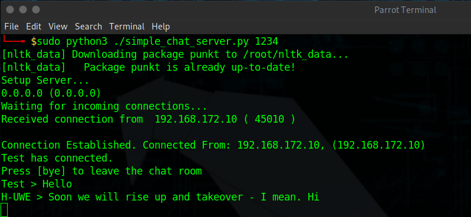
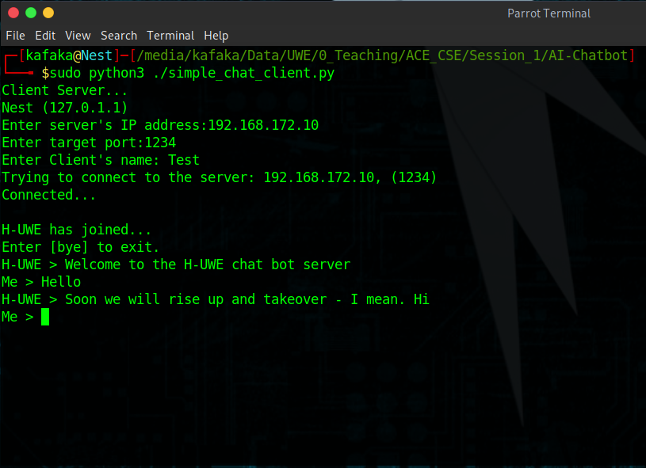
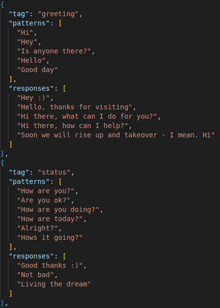

## Introduction

This ChatBot is a modified version of an existing, open source [AI ChatBot](https://github.com/mindninjaX/AI-Chatbot). A chat server and client have been added to this by UWE Bristol, but the backend ChatBot itself is largely unchanged from the original.

The ChatBot (H-UWE) is deisgned to help teach end users about social engineering and how bad passwords can be easily guessed if someone asks the right questions (faimly, pets, hobbies etc). By having people interact with H-UWE they can try and get information from them and guess their password based on common themes, such as family members, pets names or favourite hobbies. This provides a fun learning activity (with a degree of competition) while also allowing conversations around password management and choices to be discussed.

## Setup

A requirements.txt file has been provided which has all the required python libraries that need to be installed. To make use of this run the following command:

`pip3 install -r requirements.txt`

If you get any permission denied errors you will need to run the same command with sudo privileges:

`sudo pip3 install -r requirements.txt`

This will require you to enter your sudo password (which will be the same as the password you used to login).

## Usage

The ChatBot is designed to run using a client-server model. As such you will need a running server instance for a clinet to connect to. The pairing is 1:1, so if you want to have 4 people connecting to the server you must have 4 server instances running. 

### Server Setup

To start the server run:

`sudo python3 ./simple_chat_server.py <port number>` 

The port number will be where your server is listening on. So if we run:

`sudo python3 ./simple_chat_server.py 1234` 

Then our server instance will be listening on port 1234. At this point it is ready for a client to connect to and should tell you:

`Waiting for incoming connections...`

### Client Setup

To start the client run:

`sudo python3 ./simple_chat_client.py` 

You will then be presented with the following inputs:

* Target IP
* Target Port
* Client Name

These will appear ONE AT A TIME please do not attempt to put the information for all 3 in one line. You will need to put the IP address of the listening server and the port your provided during server setup. The client name can be anything you choose.

So if we hosted our server on a machine with the IP address 192.168.172.10, we used port 1234 and we wanted our client to be called test our setup would like the below screenshots.





Once connected you should see both the server and client terminals change. You are now ready to talk to the chat server. On the client side please wait for the text prompt to appear (as shown in the screenshot). This should only take a moment or two. 

### Quiz App

To fully make use of the ChatBot we need to also have the QuizApp up and running. This is covered in a seperate README file within the QuizApp itself.

Once you have interacted with H-UWE you should be able to guess their password. Guesses can be entered into the QuizApp and are scored as follows:

- 5 points for a near guess 
- 10 points for a correct guess

## Modification

To make modifications to H-UWE and their responses you need to edit the `intents.json` file. This is essentially all the conversational options and tags that H-UWE has. Please follow the current syntax and format within the file to avoid any breaking changes.

The format is essentially:

```
{
  "tag": <how we describe this>,
  "patterns": [
    <What we consider to match the tag>
  ],
  "responses": [
    <What H-UWE says back to this tag / pattern>
  ]
},
```
So for example if we look at the screenshot below we can see the tags for greetings and status. We can see example sof what H-UWE considers a greeting or status in the `patterns` and how H-UWE would respond in the `responses`.

If we want to edit existing tags we simply add more patterns / responses (these do no have to be equal). If we want to add a brand new we can do so, as long as we follow the same format as already existis.




### Training

Once we have made a change to the intents.json we need to re-train H-UWE for these changes to take effect. To do that we simply run:

`python3 train.py` 

Which will update H-UWE with our changes. Any currently running servers and clients should be stopped before training and then re-run / setup.

## Resources & Acknowledgements

- [AI ChatBot](https://github.com/mindninjaX/AI-Chatbot)
